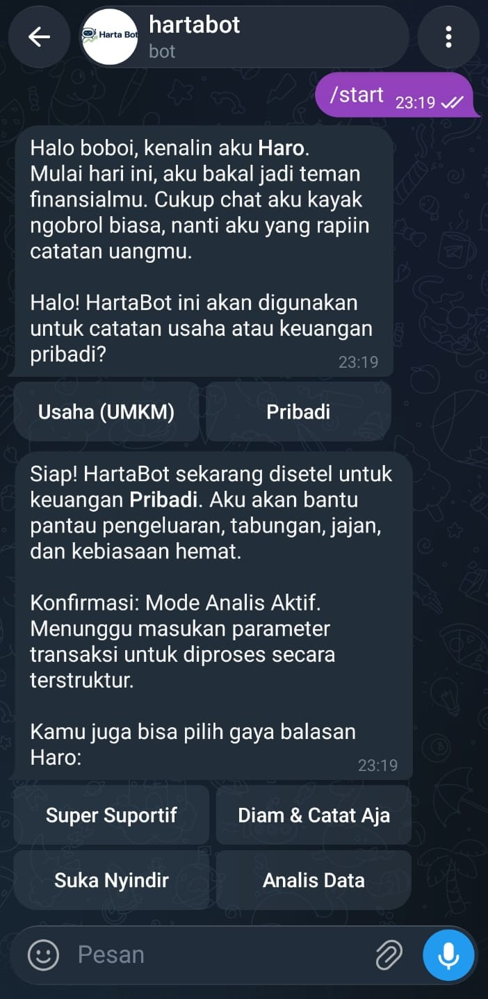
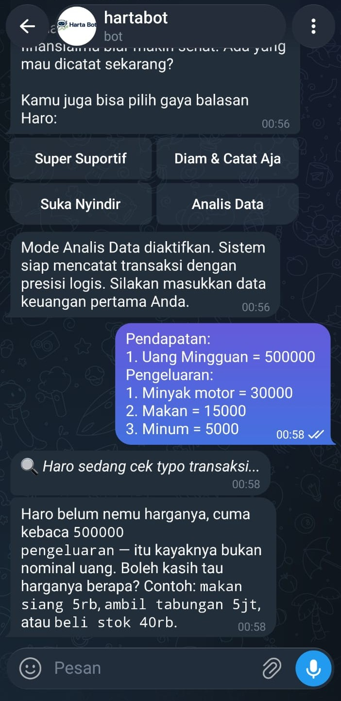
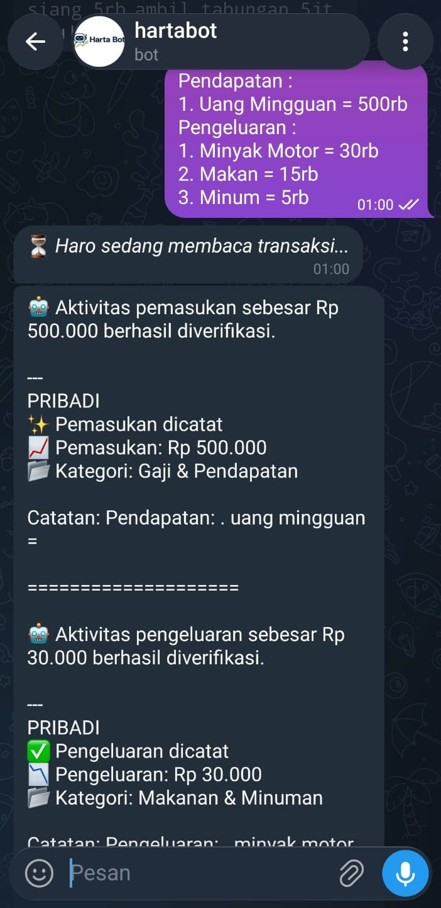
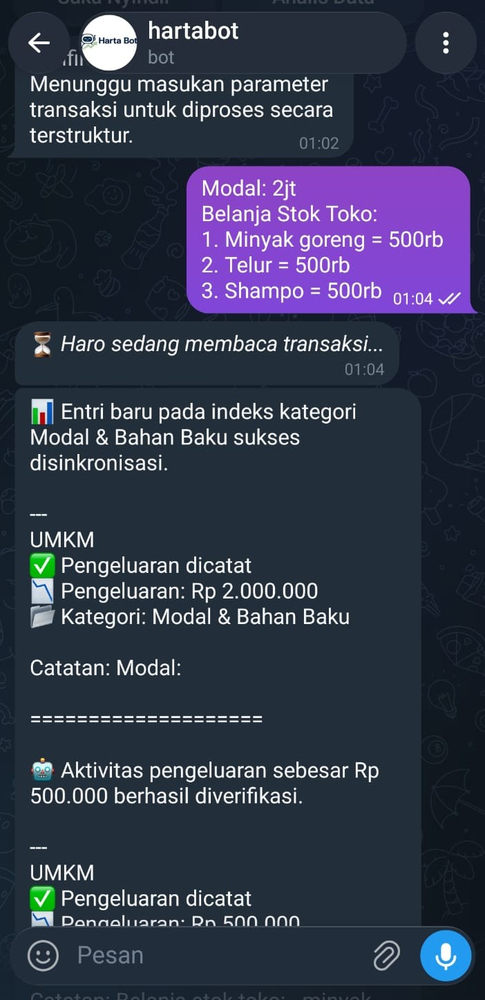

# Skenario Pengujian & Kebutuhan Uji (Test Cases)

## Fitur 1: Inisialisasi dan Pemilihan Mode (TC-BOT-001)
**Requirement:** Pengguna baru dapat memulai percakapan dan memilih mode keuangan (Pribadi/UMKM).

*   **Kondisi 1:** Pengguna mengirimkan perintah `/start`.
*   **Expected 1:** Bot membalas dengan pesan sapaan awal (Halo) dan menampilkan menu pilihan mode.
*   **Kondisi 2:** Pengguna menekan tombol menu "Pribadi".
*   **Expected 2:** Bot mengirimkan pesan konfirmasi bahwa Mode Pribadi telah aktif.
*   **Acceptance Criteria:**
    *   Bot merespons input perintah dasar tanpa hambatan atau *crash*.
    *   Menu navigasi muncul dalam bentuk tombol interaktif yang bisa diklik pengguna (bukan sekadar teks biasa).
*   **Evidence:** Screenshot percakapan yang menampilkan balasan sapaan dan tombol navigasi bot.

## Fitur 2: Validasi Input Angka Penuh (TC-BOT-002) - *Identifikasi Bug*
**Requirement:** Sistem dapat membaca input nominal transaksi berupa angka penuh tanpa format tambahan.

*   **Kondisi 1:** Pengguna memasukkan transaksi dengan angka penuh (contoh: `Pengeluaran: Minyak motor = 30000`).
*   **Expected 1:** Bot membaca nominal "30000" dan berhasil menyinkronkannya sebagai transaksi pengeluaran.
*   **Acceptance Criteria:**
    *   Sistem mengenali deretan angka standar sebagai nominal uang valid tanpa mewajibkan titik pemisah ribuan (misal: 30.000).
    *   Sistem tidak menolak pencatatan jika tidak ada singkatan huruf di belakang nominal.
*   **Evidence:** Screenshot balasan bot (Catatan bug saat ini: Bot gagal memproses angka 30000 dan mengeluarkan pesan error gagal membaca nominal).

## Fitur 3: Validasi Input Singkatan Angka (TC-BOT-003)
**Requirement:** Sistem mampu mengonversi singkatan uang kasual yang lazim digunakan di Indonesia.

*   **Kondisi 1:** Pengguna memasukkan transaksi dengan singkatan `rb` (contoh: `Makan = 15rb`).
*   **Expected 1:** Bot secara otomatis membaca dan mengonversi `15rb` menjadi Rp 15.000.
*   **Kondisi 2:** Pengguna memasukkan transaksi dengan singkatan `jt` (contoh: `Modal = 2jt`).
*   **Expected 2:** Bot secara otomatis membaca dan mengonversi `2jt` menjadi Rp 2.000.000.
*   **Acceptance Criteria:**
    *   Fungsi *parsing* (pemecahan teks) bot berhasil mendeteksi *string* "rb" dan "jt".
    *   Angka konversi yang dicatat ke laporan akhir memiliki jumlah nol (0) yang benar.
*   **Evidence:** Screenshot laporan bot yang memuat rincian nominal yang sudah dikonversi dengan tepat.

## Fitur 4: Akurasi Kategorisasi Pengeluaran (TC-BOT-004) - *Identifikasi Bug*
**Requirement:** Sistem mampu mendeteksi kata kunci barang dan memberikan kategori pengeluaran yang masuk akal.

*   **Kondisi 1:** Pengguna memasukkan item pengeluaran "Minyak Motor".
*   **Expected 1:** Bot otomatis memberikan *tag* kategori yang relevan, seperti "Transportasi" atau "Kendaraan".
*   **Acceptance Criteria:**
    *   Label kategori tidak menyimpang jauh dari jenis barang yang diinputkan.
*   **Evidence:** Screenshot balasan verifikasi bot (Catatan bug saat ini: Sistem salah mengategorikan Minyak Motor ke dalam kategori "Makanan & Minuman").

## Fitur 5: Pemrosesan Transaksi Multi-Item (TC-BOT-005) - *Identifikasi Bug*
**Requirement:** Pengguna dapat mencatat beberapa barang belanja sekaligus dalam satu kali kirim pesan (bulk input).

*   **Kondisi 1:** Pengguna memasukkan daftar belanja (contoh: `Minyak goreng = 500rb, Telur = 500rb, Shampo = 500rb`).
*   **Expected 1:** Bot memisahkan teks tersebut dan mencatat ketiga item barang secara terpisah beserta nominal masing-masing.
*   **Acceptance Criteria:**
    *   Bot mampu melakukan pemisahan data (*data splitting*) jika ada lebih dari satu barang dalam satu *chat bubble*.
    *   Total saldo akhir terpotong sesuai akumulasi dari seluruh item yang dimasukkan.
*   **Evidence:** Screenshot rekap catatan bot (Catatan bug saat ini: Bot gagal mendeteksi baris-baris rincian barang, dan hanya mendeteksi satu aktivitas pengeluaran).

